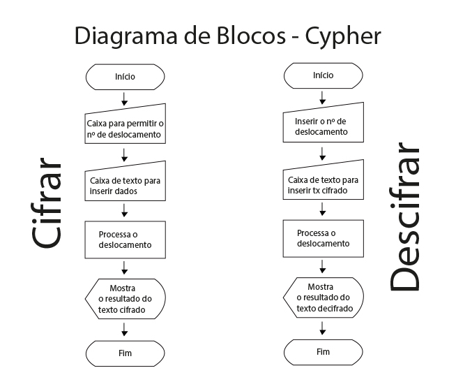
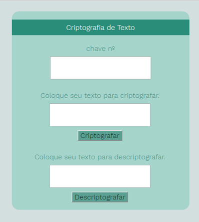

# Usuário

Um grupo de mães de um colégio querem conversar sobre as atividades de seus filhos na escola.
Como eles são adolescentes frequentemente pegam o celular das mães.
Para que eles não consigam entender as conversas, uma das mães que estuda na  <Labaratória>  criou uma aplicação para criptografar e descriptografar essas conversas.

# Descrição da Aplicação
Para isso será criado uma aplicação onde há um espaço para digitar a chave de deslocamento.
Em seguida digitar o texto a ser criptografado e um botão para o resultado.
Após o texto criptografado o usuário deve apagar a mensagem original caso queira usar a função descriptografar.
Para isso basta clicar no botão "descriptografar" que retornará o resultado do texto original.

# Diagrama de Blocos

# Layout

